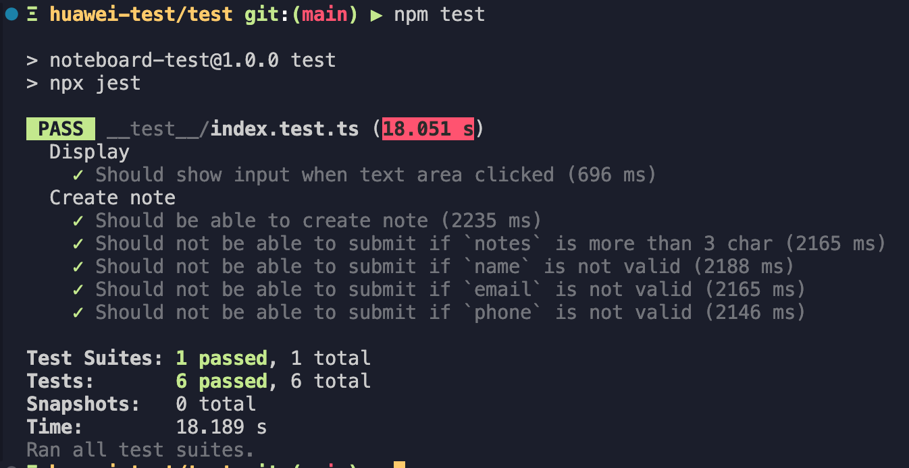

# Noteboard: Technical Test Submission - PT. Huawei Tech Investment

This repository contains the submission for the Technical Test as a Developer in PT. Huawei Tech Investment, under Digital Transformation & Analytics. The test aims to demonstrate my proficiency in Frontend development, Backend development, and Automation testing.

This repository consist of three part: Frontend (`fe/`), Backend (`be/`), and Automation testing (`test/`) that can be accessed in each folder. These parts works together to form a working application called "Noteboard".

The main feature of this application is that "_it can save notes from users, then can be displayed to all users_".

Each part has their own structure, and which will be further explained in the following sections.

## Frontend

Prompt:

> Buatlah halaman web sederhana menggunakan HTML, CSS, dan JavaScript. Halaman tersebut harus memiliki form pendaftaran dengan beberapa field, seperti nama, email, dan nomor telepon. Tambahkan validasi sederhana menggunakan JavaScript untuk memastikan bahwa semua field telah diisi sebelum data dikirimkan.


As instructed in the task document, the frontend section of this application is written in pure HTML, CSS, and Javascript. The main entry point of the frontend can be found in `fe/index.html`.

To improve the display quality, I used mainly vanilla CSS (`fe/public/global.css`) and some third-party CSS, namely:

- [Preflight](https://tailwindcss.com/docs/preflight), to "_reset_" the existing style on browser

- [Inter](https://fonts.google.com/specimen/Inter) from Google Font, to give the app the same font on different OS

Furthermore, the Javascript (`fe/public/index.js`) is being used to validate form submission, fetching data (`GET` and `POST`), and rendering element to the DOM. In this test, I strive to use Vanilla Javascript without additional third-party libraries to challenge myself.

### Usage

To start the frontend part of this app, you can just simply open `fe/index.html` on your preferred browser. However, to get the best experience, it is recommended to use **Chrome** (or Chrome-based) browser.

## Backend

Prompt:

> Bangun sebuah server sederhana menggunakan Node.js atau framework Express. Buatlah endpoint API yang dapat menerima data formulir dari frontend pada Hari 1 dan menyimpannya ke dalam sebuah penyimpanan data sederhana, misalnya dalam bentuk array di dalam server. Pastikan bahwa server dapat mengembalikan data yang telah disimpan ketika diminta oleh frontend.

The Backend service of this application main function is to store, receive, and return data from the Frontend. To achieve this, I used Node.js framework [Express](https://expressjs.com) along with [Typescript](https://www.typescriptlang.org).

Furthermore, I utilize a few third-party libraries, such as:
 - [tsup](https://github.com/egoist/tsup) to transpile and bundle the Typescript files. The transpiled file can be found in the `be/dist/` folder.
 - [date-fns](https://date-fns.org) to deal with dates, such as "data creation" time and "time distance from now".
 - [https-status-codes](https://github.com/prettymuchbryce/http-status-codes) to get a standarized HTTP status codes for REST API.

### Project Structure

The main entry point of Backend is in `be/index.ts` that only calls for `be/app.ts`.

```
be/
└── src/
    ├── notes/
    │   ├── notes.model.ts
    │   ├── notes.repo.ts
    │   ├── notes.service.ts
    │   └── notes.handler.ts
    ├── utils/
    │   └── ...
    ├── app.ts
    ├── index.ts
    └── ...
```

Furthermore, I implemented [The Clean Architecture](https://blog.cleancoder.com/uncle-bob/2012/08/13/the-clean-architecture.html) that separates the codes into several layer. This concept can be found in the `notes/` folder, where there are four different types of files. 

The lowest layer is `repo` where it usually directly handles the database (entities), but at this case, we use simple Array to store data.

The next layer is `service` where the main business logic play its part. This application has a very simple use case by nature, so in this layer I only attempted to sort and add more data for BFF (Backend for Frontend).

The highest layer is `handler`. As the name suggest, it "handles" the route of the APIs.

### Installation

To run this section, you need to have [Node.js](https://nodejs.org/en) and [npm](https://www.npmjs.com) installed on your system. I develop this application on Node.js version `v20.x.x` and npm version `9.6.x`. Feel free to use other versions, but it's untested.

After that, you can install all the dependencies by running:

```bash
# Change directory to be/
cd be
npm install
```

### Usage

To run this section on `dev` mode, you can execute:

```bash
npm run dev
```

If you want to run on `prod` mode, you can execute:

```bash
npm run build
npm run start
```

This will transpile the minified verion of the app. There should be no significant performance gap.

## Automation testing

Prompt:

> Buatlah skrip otomatis menggunakan Selenium atau Puppeteer untuk mengotomatisasi pengujian frontend yang telah Anda bangun pada Hari 1. Skrip harus dapat memasukkan data ke dalam formulir, mengirim formulir, dan memverifikasi bahwa data telah disimpan dengan benar pada server backend yang telah Anda bangun pada Hari 2.

The final part of this repository is Automation testing. To achieve this, I use [Puppeteer](https://pptr.dev) with [Jest](https://jestjs.io). This is my first time using Puppeteer and was intrigued by its ability to run test cases over the Chrome DevTools protocol.

### Project Structure

The main testing script can be found in `__test__/index.test.ts`. It consist of 6 test cases that has been grouped into two groups.

- Display
  - Should show input when text area clicked (P0)

- Create Note
  - Should be able to create note (P0)
  - Should not be able to submit if `notes` is more than 3 char (P1)
  - Should not be able to submit if `name` is not valid (P1)
  - Should not be able to submit if `email` is not valid (P1)
  - Should not be able to submit if `phone` is not valid (P1)

> Note: "P0" is Priority 0 (highest priority), "P1" is Priority 1

```
test/
└── __test__/
    ├── constants/
    │   └── index.ts
    ├── page/
    │   └── IndexPage.ts
    ├── utils/
    │   └── index.ts
    └── index.test.ts
```    

Furthermore, I to implement a very simple version of [Page Object Model](https://www.selenium.dev/documentation/test_practices/encouraged/page_object_models/) (POM). Page Object Model is a concept that models a page that the test case interact with as an object. In this case, it can be found on `page/IndexPage.ts`, where I bundled up all the selector on a `class` object and the test case script can be focus on the necessary flow and assertion. In my opinion, this concept makes the test case script cleaner.

### Installation

To run this section, you need to have [Node.js](https://nodejs.org/en) and [npm](https://www.npmjs.com) installed on your system. I develop this application on Node.js version `v20.x.x` and npm version `9.6.x`. Feel free to use other versions, but it's untested.

After that, you can install all the dependencies by running:

```bash
# Change directory to test/
cd test
npm install
```

Moreover, you need to have at least one [Chromium based](https://www.google.com/chrome/) browser installed on your system.

### Usage

First of all, make sure that the Backend service is running!.

To run the script, you can simply execute this command:

```bash
npm test
```

The result will look something like this:

